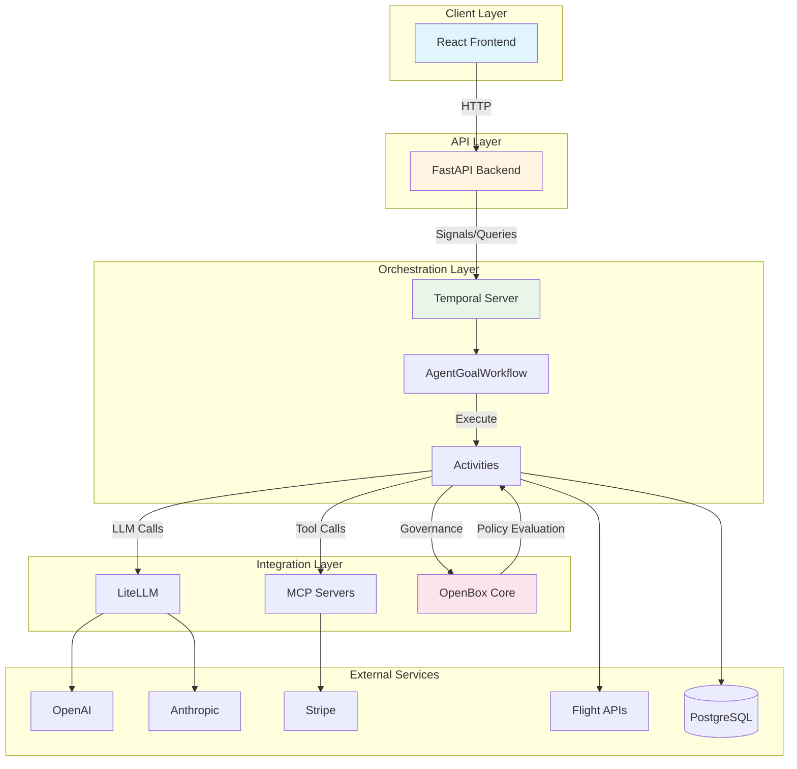
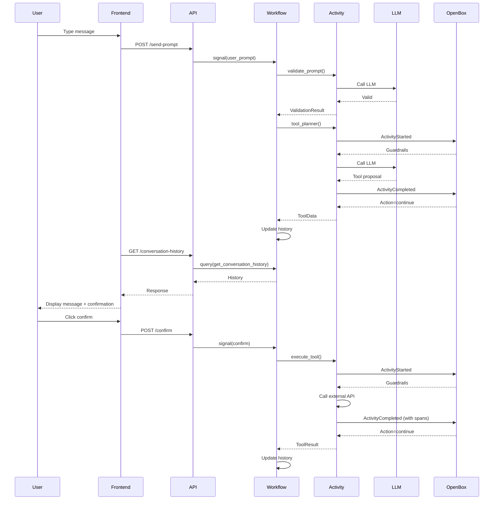

# System Architecture

**Generated:** 2026-01-31
**Version:** 0.2.0
**Purpose:** Technical architecture for Temporal AI Agent with OpenBox Governance

## High-Level Architecture



## Component Architecture

### 1. Frontend Layer (React)

**Purpose:** User interface for agent conversations

**Components:**
```
frontend/
├── src/
│   ├── components/
│   │   ├── ChatWindow.jsx         # Main chat container
│   │   ├── MessageBubble.jsx      # Message display
│   │   ├── ConfirmInline.jsx      # Tool confirmation UI
│   │   ├── LLMResponse.jsx        # Structured response renderer
│   │   ├── NavBar.jsx             # Navigation header
│   │   └── LoadingIndicator.jsx  # Loading states
│   ├── hooks/
│   │   └── useLocalChatHistory.js # localStorage persistence
│   ├── services/
│   │   └── api.js                 # Backend API client
│   └── pages/
│       └── App.jsx                # Root component
```

**Technology:**
- React 18 (hooks, functional components)
- Tailwind CSS (styling)
- Vite (build tool)
- Axios (HTTP client)

**State Management:**
- Local state (useState)
- localStorage for persistence
- Polling for updates (1s interval)

**Data Flow:**
1. User types message → `ChatWindow`
2. Submit → `api.sendPrompt()`
3. Poll → `api.getConversationHistory()`
4. Render messages → `MessageBubble`
5. Show tool confirmation → `ConfirmInline`
6. User confirms → `api.sendConfirm()`

### 2. API Layer (FastAPI)

**Purpose:** REST API bridge to Temporal workflows

**Endpoints:**
```python
# api/main.py
POST   /send-prompt              # Send user message to workflow
POST   /confirm                  # Confirm tool execution
POST   /end-chat                 # End conversation
POST   /start-workflow           # Initialize workflow
GET    /get-conversation-history # Query conversation state
GET    /tool-data                # Get latest tool call
GET    /agent-goal               # Get current agent
```

**Architecture:**
```
┌─────────────────────────────────────┐
│         FastAPI Application         │
├─────────────────────────────────────┤
│  Routes         │  Dependencies     │
│  - /send-prompt │  - Temporal Client│
│  - /confirm     │  - CORS Middleware│
│  - /end-chat    │  - Error Handlers │
└─────────────────┴───────────────────┘
         │
         ▼
┌─────────────────────────────────────┐
│      Temporal Client                │
│  - start_workflow()                 │
│  - get_workflow_handle()            │
│  - signal()                         │
│  - query()                          │
└─────────────────────────────────────┘
```

**Configuration:**
- CORS: `localhost:5173` (dev)
- Timeout: 30s per request
- Error handling: HTTP exceptions
- Temporal connection: Via `get_temporal_client()`

### 3. Workflow Layer (Temporal)

**Purpose:** Deterministic orchestration of agent logic

**Architecture:**
```
┌───────────────────────────────────────────────────────┐
│              AgentGoalWorkflow                         │
├───────────────────────────────────────────────────────┤
│  State:                                               │
│  - conversation_history: ConversationHistory          │
│  - prompt_queue: Deque[str]                          │
│  - tool_data: Optional[ToolData]                     │
│  - goal: AgentGoal                                   │
│  - confirmed: bool                                    │
│  - chat_ended: bool                                   │
├───────────────────────────────────────────────────────┤
│  Signals:                                             │
│  - user_prompt(prompt: str)                          │
│  - confirm()                                          │
│  - end_chat()                                         │
├───────────────────────────────────────────────────────┤
│  Queries:                                             │
│  - get_conversation_history() -> ConversationHistory │
│  - get_agent_goal() -> AgentGoal                     │
│  - get_latest_tool_data() -> ToolData                │
├───────────────────────────────────────────────────────┤
│  Main Loop:                                           │
│  1. Wait for signal (prompt/confirm/end)             │
│  2. Validate user input                              │
│  3. Call LLM for planning                            │
│  4. Wait for confirmation (if needed)                │
│  5. Execute tool via activity                        │
│  6. Update conversation history                      │
│  7. Check continue-as-new (250 turns)                │
│  8. Repeat                                            │
└───────────────────────────────────────────────────────┘
```

**Key Patterns:**

**Determinism:**
- No random numbers
- No current time
- No HTTP calls
- No file I/O
- All non-deterministic ops → activities

**State Management:**
- Instance variables for workflow state
- Signals modify state asynchronously
- Queries read state synchronously
- Continue-as-new for long workflows

**Goal Selection & Switching:**
- **Agent Selection Goal:** Meta-agent lists available agents via `ListAgents` tool
- **ChangeGoal Tool:** Users switch agents mid-conversation
- **Multi-Goal Mode:** Enabled via `AGENT_GOAL=multi` env var
  - Workflow starts with goal selection
  - Users can switch via tool call
  - Each goal has distinct tools and persona
  - Example: Start as Travel Agent, switch to Finance Agent

### 4. Activity Layer

**Purpose:** Non-deterministic operations (LLM, HTTP, DB)

**Activity Types:**

**1. LLM Activities:**
```python
# activities/tool_activities.py

@activity.defn(name="agent_toolPlanner")
async def agent_toolPlanner(input: ToolPromptInput) -> Dict[str, Any]:
    """Call LLM to determine next action."""
    # Input: user prompt + context
    # Output: {next: "confirm"|"question"|"done", tool: str, args: dict}

@activity.defn(name="agent_validatePrompt")
async def agent_validatePrompt(input: ValidationInput) -> ValidationResult:
    """Validate user prompt against agent goal."""
    # Input: prompt + goal + history
    # Output: {validationResult: bool, validationFailedReason: str}
```

**2. Tool Execution Activities:**
```python
# Finance tools
@activity.defn(name="get_account_balances")
@activity.defn(name="move_money")
@activity.defn(name="submit_loan_application")

# Travel tools
@activity.defn(name="search_flights")
@activity.defn(name="search_trains")
@activity.defn(name="find_events")

# HR tools
@activity.defn(name="book_pto")
@activity.defn(name="current_pto")

# E-commerce tools
@activity.defn(name="get_order")
@activity.defn(name="track_package")
```

**3. MCP Activities:**
```python
@activity.defn(name="mcp_list_tools")
async def mcp_list_tools(
    server_def: MCPServerDefinition,
    include_tools: Optional[List[str]]
) -> Dict[str, Any]:
    """Load tools from MCP server."""
    # 1. Start MCP server (stdio/SSE)
    # 2. Send list_tools request
    # 3. Return tool schemas
```

**Activity Interceptors:**
```
┌─────────────────────────────────────────────┐
│     ActivityGovernanceInterceptor           │
│  (from OpenBox SDK)                         │
├─────────────────────────────────────────────┤
│  1. Intercept activity start                │
│  2. Send ActivityStarted to OpenBox         │
│  3. Apply guardrails (input redaction)      │
│  4. Execute activity                        │
│  5. Collect HTTP spans                      │
│  6. Intercept activity complete             │
│  7. Send ActivityCompleted to OpenBox       │
│  8. Apply guardrails (output redaction)     │
│  9. Return result or throw error            │
└─────────────────────────────────────────────┘
```

### 5. OpenBox Governance Layer

**Purpose:** Policy enforcement and observability

**Architecture:**
```
┌─────────────────────────────────────────────────────┐
│              Temporal Worker Process                 │
│                                                      │
│  ┌────────────────────────────────────────────────┐ │
│  │  Workflow Interceptor                          │ │
│  │  - Captures lifecycle events                   │ │
│  │  - Sends via activity (determinism)            │ │
│  └────────────────────────────────────────────────┘ │
│                                                      │
│  ┌────────────────────────────────────────────────┐ │
│  │  Activity Interceptor                          │ │
│  │  - Captures input/output                       │ │
│  │  - Sends directly to OpenBox                   │ │
│  │  - Applies guardrails                          │ │
│  └────────────────────────────────────────────────┘ │
│                                                      │
│  ┌────────────────────────────────────────────────┐ │
│  │  WorkflowSpanProcessor                         │ │
│  │  - Buffers spans per workflow_id               │ │
│  │  - Merges body/header data                     │ │
│  │  - Associates traces with activities           │ │
│  └────────────────────────────────────────────────┘ │
│                                                      │
│  ┌────────────────────────────────────────────────┐ │
│  │  OTel Instrumentation                          │ │
│  │  - HTTP (httpx, requests, urllib3)             │ │
│  │  - Database (psycopg2, asyncpg, etc.)          │ │
│  │  - File I/O (optional)                         │ │
│  └────────────────────────────────────────────────┘ │
└──────────────────────┬───────────────────────────────┘
                       │ HTTP
                       ▼
         ┌─────────────────────────────┐
         │     OpenBox Core             │
         │  POST /governance/evaluate   │
         │                              │
         │  Input: Event + Spans        │
         │  Output: Action + Guardrails │
         └─────────────────────────────┘
```

**Approval Flow (v0.2.0 - Polling from Core):**
1. **Activity Starts** → Interceptor captures input → Send `ActivityStarted` event
2. **Core Evaluates** → Check policies → Return guardrails (redaction)
3. **Activity Executes** → Modified input → HTTP/DB calls traced as spans
4. **Activity Completes** → Interceptor captures output
5. **Workflow Polls Core** → Direct HTTP call with `ActivityCompleted` event + spans
6. **Core Returns Action** → `continue` or `stop`
7. **Workflow Proceeds or Terminates** → Based on Core decision

**Governance Actions:**
- `continue`: Allow workflow to proceed
- `stop`: Terminate workflow (non-retryable error)

**Guardrails:**
```json
{
  "input_type": "activity_input",
  "redacted_input": {"prompt": "[REDACTED]", "user_id": "123"},
  "validation_passed": true,
  "reasons": []
}
```

**Span Collection:**
```
Activity Execution
    │
    ├─ HTTP Request 1 (OpenAI API)
    │   ├─ Request headers
    │   ├─ Request body
    │   ├─ Response headers
    │   └─ Response body
    │
    ├─ Database Query (PostgreSQL)
    │   ├─ SQL statement
    │   ├─ Database name
    │   └─ Query duration
    │
    └─ HTTP Request 2 (Stripe API)
        ├─ Request headers
        ├─ Request body
        ├─ Response headers
        └─ Response body
```

### 5.5 OpenBox SDK Integration (v0.2.0)

**SDK Location:** External package (`openbox-temporal-sdk-python`) - moved outside repo (commit 20a4623)

**Factory Function:** `create_openbox_worker()`
- Wraps worker with governance interceptors
- Configures span collection (HTTP, DB, file I/O)
- Enables policy enforcement
- Handles fail-open/fail-closed modes

**Configuration via env vars:**
- `OPENBOX_URL`: Core endpoint
- `OPENBOX_API_KEY`: Authentication
- `OPENBOX_GOVERNANCE_POLICY`: fail_open (default) or fail_closed

### 6. Integration Layer

#### LiteLLM Integration

**Purpose:** Multi-provider LLM abstraction

```python
from litellm import acompletion

async def call_llm(
    prompt: str,
    context: str,
    model: str = "gpt-4"
) -> Dict[str, Any]:
    """Call LLM with unified interface."""
    response = await acompletion(
        model=model,
        messages=[
            {"role": "system", "content": context},
            {"role": "user", "content": prompt}
        ],
        response_format={"type": "json_object"}
    )
    return json.loads(response.choices[0].message.content)
```

**Supported Providers:**
- OpenAI (gpt-4, gpt-3.5-turbo)
- Anthropic (claude-3-5-sonnet, claude-3-opus)
- Google (gemini-pro)
- Azure OpenAI
- Local models (Ollama)

#### MCP Integration

**Purpose:** Dynamic tool loading from external servers

**Architecture:**
```
┌─────────────────────────────────────────────────────┐
│              MCP Client Manager                      │
├─────────────────────────────────────────────────────┤
│  Server Lifecycle:                                  │
│  1. start_server(definition) -> client              │
│  2. Keep client in pool                             │
│  3. cleanup() on workflow end                       │
├─────────────────────────────────────────────────────┤
│  Protocol:                                          │
│  - Stdio transport (subprocess)                     │
│  - SSE transport (HTTP)                             │
│  - JSON-RPC 2.0 messages                            │
└─────────────────────────────────────────────────────┘
```

**Tool Loading Flow:**
1. Workflow starts with goal containing `mcp_server_definition`
2. Activity `mcp_list_tools` called
3. MCPClientManager starts server process
4. Send `list_tools` JSON-RPC request
5. Server responds with tool schemas
6. Convert to ToolDefinition objects
7. Add to goal's tools list
8. LLM sees tools in prompt context
9. User triggers tool → Activity calls MCP server
10. Server executes and returns result

**Example Server Definition:**
```python
MCPServerDefinition(
    name="stripe",
    command="uvx",
    args=["mcp-server-stripe"],
    env={"STRIPE_API_KEY": os.getenv("STRIPE_API_KEY")},
    included_tools=["create_payment_intent", "list_customers"]
)
```

### 7. Data Layer

#### Conversation State (In-Memory)

```python
ConversationHistory = {
    "messages": [
        {
            "actor": "user" | "agent" | "tool_result" | "user_confirmed_tool_run",
            "response": str | Dict[str, Any]
        }
    ]
}
```

#### Tool Data (In-Memory)

```python
ToolData = {
    "next": "confirm" | "question" | "pick-new-goal" | "done",
    "tool": str,  # Tool name
    "args": Dict[str, Any],  # Tool arguments
    "response": str,  # Agent message
    "force_confirm": bool  # Require user confirmation
}
```

#### Agent Goals (Code-Defined)

```python
AgentGoal = {
    "id": str,
    "category_tag": str,
    "agent_name": str,
    "agent_friendly_description": str,
    "tools": List[ToolDefinition],
    "description": str,
    "starter_prompt": str,
    "example_conversation_history": str,
    "mcp_server_definition": Optional[MCPServerDefinition]
}
```

## Deployment Architecture

**Development:** Docker Compose (Temporal, PostgreSQL) + local Python/API/Frontend processes

**Production:** Kubernetes cluster with:
- API Pods (load balanced, auto-scaling)
- Worker Pods (auto-scaling, OpenBox enabled)
- Temporal Cloud (managed)
- PostgreSQL (managed)
- Frontend (CDN)

## Security & Observability

**Security:**
- TLS 1.3 for all HTTP traffic
- mTLS for Temporal connections
- API key authentication (OpenBox, Temporal)
- Secrets in environment variables (not committed)
- OpenBox guardrails redact PII automatically

**Observability:**
- Workflow logs in Temporal history
- Activity logs to stdout/CloudWatch
- HTTP/DB spans auto-captured by OpenBox
- Metrics: workflow count, activity duration, tool usage
- Audit trail via governance events

│    - Activity executions                            │
│    - Success/failure rate                           │
│    - Retry count                                     │
│    - Duration (p50, p95, p99)                       │
│                                                      │
│  API Metrics:                                       │
│    - Request rate                                    │
│    - Response time                                   │
│    - Error rate                                      │
│    - Active connections                              │
│                                                      │
│  OpenBox Metrics:                                   │
│    - Governance evaluations                         │
│    - Policy violations                              │
│    - Guardrails applied                             │
│    - Stop actions triggered                         │
└─────────────────────────────────────────────────────┘
```

## Scalability Considerations

### Horizontal Scaling

**Worker Scaling:**
```
Metrics → HPA → Scale Worker Pods
- CPU utilization > 70%
- Memory utilization > 80%
- Task queue depth > 100
```

**API Scaling:**
```
Metrics → HPA → Scale API Pods
- Request rate > 1000/s
- Response time > 500ms
- CPU utilization > 70%
```

### Vertical Scaling

**Workflow History Size:**
- Continue-as-new after 250 turns
- Conversation summary passed to new workflow
- Prevents history size issues

**Activity Parallelization:**
- Independent activities run in parallel
- Gather pattern for multiple results
- Reduces total workflow duration

### Resource Limits

**Worker Configuration:**
```python
worker = create_openbox_worker(
    max_concurrent_workflow_tasks=100,
    max_concurrent_activity_tasks=200,
    max_cached_workflows=1000,
)
```

**Database Connection Pool:**
```python
DATABASE_POOL_SIZE = 20
DATABASE_MAX_OVERFLOW = 10
```

## Failure Scenarios & Recovery

### Workflow Failures

**Scenario: Activity timeout**
- Temporal retries automatically
- Exponential backoff
- Max 3 attempts
- Workflow continues or fails

**Scenario: Workflow worker crash**
- Temporal detects via heartbeat
- Restarts workflow on another worker
- Workflow state preserved in history
- Continues from last activity

**Scenario: LLM API failure**
- Activity retry (3 attempts)
- If all fail, inform user
- Add error message to conversation
- Workflow continues (doesn't crash)

### API Failures

**Scenario: Temporal server unavailable**
- API returns 503 Service Unavailable
- Frontend shows error
- Retry after delay

**Scenario: Workflow not found**
- API attempts to start workflow
- Returns empty conversation history
- Frontend shows fresh chat

### OpenBox Failures

**Scenario: OpenBox Core down (fail_open mode)**
- Activities execute without governance
- Warning logged
- No blocking

**Scenario: OpenBox Core down (fail_closed mode)**
- Activities fail immediately
- Workflow terminates
- User sees error

## Performance Characteristics

### Latency Breakdown

**End-to-end user message:**
```
User sends message → API receives: 10ms
API signals workflow → Signal processed: 5ms
Workflow validates input (activity): 1000ms (LLM call)
Workflow plans action (activity): 2000ms (LLM call)
Workflow updates history: 5ms
Frontend polls and receives: 50ms
Total: ~3070ms (3.1s)
```

**Tool execution:**
```
User confirms → API receives: 10ms
API signals workflow → Signal processed: 5ms
Workflow executes tool (activity): 500ms (API call)
Activity sends to OpenBox: 100ms
OpenBox evaluates: 200ms
Activity returns: 50ms
Total: ~865ms
```

### Throughput

**Single Worker:**
- 100 concurrent workflows
- 200 concurrent activities
- ~50 LLM calls/minute (rate limit dependent)

**Scaled Workers (10 pods):**
- 1000 concurrent workflows
- 2000 concurrent activities
- ~500 LLM calls/minute

## System Diagrams

### Conversation Flow Sequence



## References

- **Temporal Architecture:** https://docs.temporal.io/concepts/what-is-temporal
- **OpenBox SDK Architecture:** See project README.md
- **FastAPI Architecture:** https://fastapi.tiangolo.com/architecture/
- **React Architecture:** https://react.dev/learn/thinking-in-react
